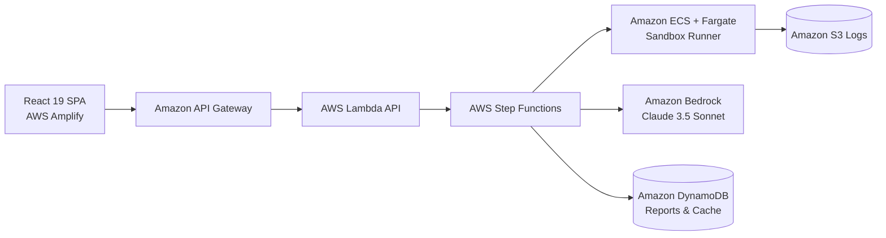

# FirstPR — Verified Open-Source Contributions

> **FirstPR turns any open-source repository into a guided, verified first contribution — it finds an issue you can actually solve, proves the development environment works before you touch it, and walks you through the fix in the real code.**

Built for **WeMakeDevs × AWS — Bharat Builds Tour — Stop 1: First Commit (17–20 September 2026)**.

[](https://github.com/Katakam-Krupavathi/squads)
[](https://github.com/Katakam-Krupavathi/squads)

---

## 🌐 Live Demo & Deployment

- **GitHub Repository**: [`https://github.com/Katakam-Krupavathi/squads`](https://github.com/Katakam-Krupavathi/squads)
- **Production Host**: **AWS Amplify Hosting** (Monorepo root: `frontend/`)
- **Demo Mode**: 100% Deterministic Mock Mode (`VITE_USE_MOCK_API=true`) for zero-risk, high-reliability hackathon judging and live evaluation.
- **Continuous Deployment**: Automated via `amplify.yml` monorepo configuration tracking branch `main`.

> *Note: The public demo runs using deterministic mock analyses for demo reliability and offline evaluation. Live AWS services (Fargate/Bedrock) are detailed in the architecture section.*

---

## 🎯 The Core Problem

Open-source contribution suffers from three major onboarding failures:

1. **The Environment Wall**: A beginner clones a repository but fails to get it running due to runtime mismatches, missing dependencies, or broken build steps.
2. **The "Good First Issue" Label Lie**: Issues are often labelled `good first issue` while secretly requiring cross-cutting architectural changes, deep framework knowledge, or modifications to central bottlenecks.
3. **The Orientation Gap**: Even after setting up, newcomers don't know which files to read, where the behavior originates, or where tests live.

---

## 🚀 What FirstPR Does

- **🔍 Evidence-Based Difficulty Scoring**: Independently computes issue difficulty across **7 deterministic signals**. The AI explains the score — it *never invents it*.
- **⚠️ Exposes Mislabelled Issues**: Catches misleading `good first issue` tags and spotlights high-risk architectural traps with hard repository evidence.
- **⚡ Real Isolated Environment Verification**: Actually executes `install`, `build`, and `test` inside an **AWS ECS / Fargate** sandbox, capturing exit codes and terminal logs instead of guessing commands.
- **🗺️ Grounded Contribution Walkthroughs**: Generates step-by-step file reading timelines strictly validated against the real repository tree (**Zero Hallucinated Paths**).

---

## 🎮 Running the UI in Demo Mode

FirstPR includes a 100% deterministic, zero-risk Demo Mode for hackathon judging and evaluation.

> **Demo Mode uses deterministic precomputed repository analyses and does not require external GitHub API rate limits or AWS service credentials to run.**

### Start the Frontend:
```bash
cd frontend
npm install
npm run dev
```

Visit `http://localhost:3000` in your browser.

### 5 Precomputed Demo Scenarios Available:
1. **`chalk/chalk` (JavaScript / Node.js)**: 3 candidate issues, 1 Genuinely Beginner (#524), 1 Moderate (#510), 1 Mislabelled Issue (#491) exposed with 7-signal evidence, verified sandbox environment with test logs.
2. **`fastapi/fastapi` (Python)**: Richer codebase with pytest, 1 beginner tutorial issue (#9820), 1 moderate OpenAPI issue (#9210), 1 mislabelled async generator leak (#8431), verified environment.
3. **`vercel/ms` (TypeScript)**: Small micro-utility codebase, sub-second Vitest feedback, quick beginner issue (#162).
4. **`example/broken-build` (Node version mismatch)**: Demonstrates honest failure reporting — install succeeds, build fails with Node 20 vs 22 diagnostic error and recommended fix.
5. **`example/unsupported-stack` (Bare-metal Rust/Zig)**: Static repo analysis succeeds while environment runner gracefully flags unsupported bare-metal hardware.

---

## 🔬 How the 7-Signal Difficulty Engine Works

FirstPR uses a transparent, documented weighted formula ($\sum \text{Weights} = 1.0$):

| Signal | Weight | What It Measures |
|---|---|---|
| **1. Blast Radius** | `22%` | Number of files and symbols likely affected; checks localized vs cross-cutting scope. |
| **2. Structural Centrality** | `16%` | Import graph analysis distinguishing core architectural hubs from leaf modules. |
| **3. Local Complexity** | `14%` | AST LOC, branching points, cyclomatic heuristics, and nesting levels. |
| **4. Test Proximity** | `14%` | Closeness and presence of dedicated unit test suites (inverted risk). |
| **5. Specification Quality** | `16%` | Presence of reproduction steps, error logs, stack traces, and acceptance criteria (inverted risk). |
| **6. Social State** | `10%` | Assignee status, active PRs, "I'll work on this" comments, and staleness detection. |
| **7. Domain Prerequisites** | `8%` | Specialist domain knowledge (Cryptography, Compilers, Raft, Kernel, Async Concurrency). |

### Classification Buckets:
- **Genuinely Beginner** ($\le 35/100$)
- **Moderate** ($36 - 65/100$)
- **Mislabelled** ($> 65/100$ with a beginner label on GitHub)

---

## 🏗️ AWS Cloud Architecture



### AWS Services Breakdown:
- **AWS Amplify Hosting**: Hosts the responsive React SPA on CloudFront edge CDN with automated CI/CD.
- **Amazon API Gateway & AWS Lambda**: Serverless ingestion and REST API endpoints.
- **AWS Step Functions**: Orchestrates the multi-stage parallel analysis pipeline.
- **Amazon ECS + AWS Fargate**: Executes isolated container builds with zero AWS credentials exposed.
- **Amazon Bedrock (Claude 3.5 Sonnet)**: Synthesizes evidence-grounded walkthroughs.
- **Amazon DynamoDB**: Stores cached evaluations with automatic TTL.
- **Amazon S3**: Persists container execution stdout/stderr terminal logs.
- **Amazon CloudWatch**: Observability, durations, error alarms, and cost monitoring (~$0.0028/analysis).

---

## 🧪 Automated Testing & Verification

### Run Backend Pytest Suite:
```bash
cd backend
python -m pytest tests/ -v
# 16/16 Passed (100% Green)
```

### Run Frontend Vitest Suite:
```bash
cd frontend
npm run test
# 9/9 Passed (100% Green)
```

### Production Bundle Check:
```bash
cd frontend
npm run build
# Built successfully in ~4s with 0 errors
```

---

## 👥 Team & Hackathon Submission

Built for **WeMakeDevs × AWS — Bharat Builds Tour — Stop 1: First Commit**
- Target Tracks: **Ship It — First Prize** & **Best UI**
- License: MIT
