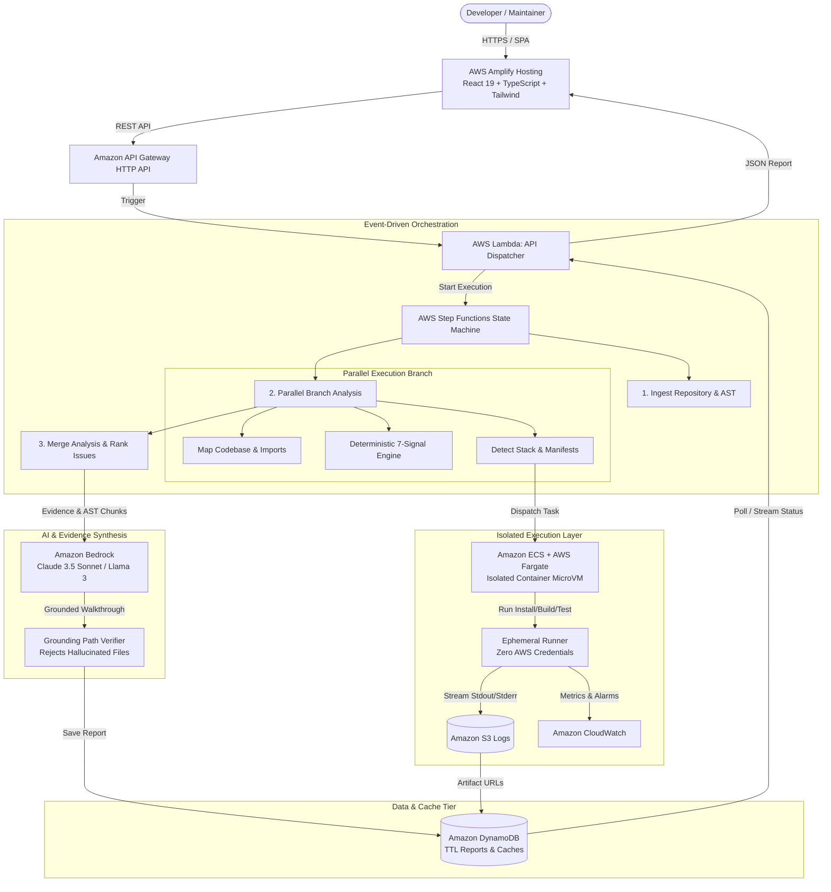

# FirstPR — System Architecture

FirstPR is an AI-powered open-source contributor onboarding and repository verification platform engineered for the **WeMakeDevs × AWS — Bharat Builds Tour (First Commit)** hackathon.

---

## 1. High-Level Architecture Diagram

---

## 2. AWS Services Mapping & Responsibilities

| AWS Service | Architecture Responsibility | Why It Was Chosen |
|---|---|---|
| **AWS Amplify Hosting** | Frontend Web Hosting | Edge CloudFront distribution, automated continuous deployment, sub-second global asset delivery. |
| **Amazon API Gateway** | Managed REST API Gateway | Native HTTP API with low latency, payload validation, CORS handling, and direct Lambda integrations. |
| **AWS Lambda** | Serverless Compute | Auto-scaling ingestion, tree filtering, and API endpoints with zero idle cost. |
| **AWS Step Functions** | Distributed Workflow Orchestration | Differentiates transient errors from terminal failures, coordinates parallel AST mapping and issue scoring. |
| **Amazon ECS + AWS Fargate** | Isolated Execution Sandbox | Runs untrusted repository setup, builds, and tests inside isolated microVM containers with CPU/memory caps. Zero credentials exposed. |
| **Amazon Bedrock** | AI Intelligence & Explanation | Synthesizes grounded walkthroughs and explains deterministic scores using Claude 3.5 Sonnet without hallucinating file paths. |
| **Amazon DynamoDB** | Persistence & Fast Cache | Single-digit millisecond latency for analysis reports and pre-computed demo caches with automatic TTL expiration. |
| **Amazon S3** | Log & Artifact Storage | Cost-effective storage for full container stdout/stderr execution logs and repository snapshots. |
| **Amazon CloudWatch** | Structured Observability | Tracks execution durations, pipeline bottlenecks, sandbox error logs, and cost analytics. |

---

## 3. The 7-Signal Deterministic Difficulty Engine

FirstPR computes difficulty using measurable repository facts, not prompt speculation:

$$ \text{Total Score} = \sum_{i=1}^7 (\text{Raw Score}_i \times \text{Weight}_i) $$

1. **Blast Radius (22%)**: Estimates number of touched files and symbols.
2. **Structural Centrality (16%)**: Import graph analysis distinguishing core architectural hubs from leaf modules.
3. **Local Complexity (14%)**: AST LOC, branch counts, and nesting depths.
4. **Test Proximity (14%)**: Inverted risk based on presence and closeness of automated test suites.
5. **Specification Quality (16%)**: Measures reproduction steps, code logs, and acceptance criteria.
6. **Social State (10%)**: Assignees, active PRs, "I'll work on this" comments, and staleness detection.
7. **Domain Prerequisites (8%)**: Identifies specialist topics (Crypto, Compilers, Raft, Kernel, Async Concurrency).

---

## 4. Cost Efficiency Model

- **Per-Analysis Cost**: ~**$0.0028 USD**
- **Fargate Task (1 vCPU, 2GB, 6s run)**: ~$0.00008 USD
- **Lambda Execution (500ms total)**: ~$0.00001 USD
- **Bedrock Claude 3.5 (500 tokens)**: ~$0.0020 USD
- **DynamoDB & S3 writes**: ~$0.00002 USD
- **Demo pre-cached requests**: **$0.00000 USD**
